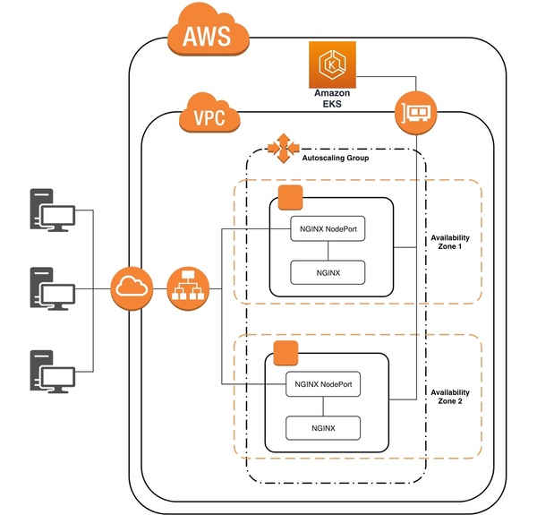
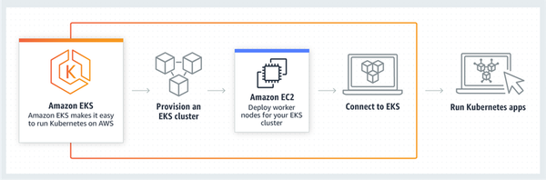

# AWS EKS with Nginx example

This example aims to demonstrate how to deploy a kubernetes cluster using EKS as the Kubernetes managed service and Nginx (as web server, reverse proxy, cache solution or any other Nginx functionality that you may need).

## Architecture Overview

The picture below presents a high level overview of the infrastructure deployment.



This example uses AWS EKS as the managed containers orchestration solution as it simplifies the Kubernetes cluster management. AWS manages the EKS infrastructure across multiple availability zones and any unhealthy node is automatically replaced.

The following picture was extracted from the AWS AKS product page and gives an idea of how it works.



Worker nodes implementation use AWS Auto Scaling functionality to benefit from cloud elasticity, maintaining the performance according to demand and optmising costs. The autscaling group deploys workers nodes across multiple availability zones to increase availability and recoverability.

From the [Kubernetes Ingress](https://kubernetes.io/docs/concepts/services-networking/ingress/) perspective, we will implement an 'ALB + NGINX' ingress approach. It uses a AWS ALB as internet facing load balancer, automatically managed by [ALB Ingress Controller](https://github.com/kubernetes-sigs/aws-alb-ingress-controller) (more information about EKS with ALB Ingress Controller can be found [here](https://aws.amazon.com/blogs/opensource/kubernetes-ingress-aws-alb-ingress-controller/)). Then NGIX will be responsible for the final routing.

## Requirements

### AWS Credentials

This example uses the environment variables approach to provide AWS credentials. Therefore the following environment variables must be set before the deployment:

- AWS_ACCESS_KEY_ID
- AWS_SECRET_ACCESS_KEY
- AWS_DEFAULT_REGION

More information about how to use AWS CLI environment variables can be found [here](https://docs.aws.amazon.com/cli/latest/userguide/cli-configure-envvars.html).

### Required Applications

The following application must be installed in the machine that will run the automated deployment:

- [kubectl](https://kubernetes.io/docs/tasks/tools/install-kubectl/) 
- [aws-iam-authenticator](https://docs.aws.amazon.com/eks/latest/userguide/install-aws-iam-authenticator.html)
- [aws-cli](https://docs.aws.amazon.com/cli/latest/userguide/cli-chap-install.html)
- [terraform](https://learn.hashicorp.com/terraform/getting-started/install.html)

## Configuration files

This template will automatically create the kubeconfig file (used to configure access to Kubernetes cluster).

**IMPORTANT!** Backup any existing kubeconfig file as terraform will overwrite it! 

## Platform Deployment


The environments sub-folders represent the target environment where the template is will be deployed. For this example we will only use development (dev) environment.

To deploy this example, just go to the `dev/container/managed` and run the following terraform commands described bellow.

First we need to initialise our working directory:
```
terraform init
```
Now we can create our execution plan:

```
terraform plan
```
And finally apply the changes:
```
terraform plan
```
Now you should have:
- AWS EKS cluster
- 2 worker nodes joined the cluster
- NGINX and ALB Ingress Controller deployed to Kubernetes
- 1 AWS ALB created and configured
- All necessary routes, security groups, roles and other resources necessary to support the solution.

The only thing left to do is the DNS configuration, which was not included in this template as you may not have a domain registered in your AWS Route 53. The next section present couple options to implement it.

## DNS Configuration

If you have a domain registered on your Route 53, just create an alias record and point it to the ALB created above. 

If you don't have a domain registered on Route 53, just add a line in your machine hosts file with ALB ip address and the EKS Cluster hostname (this info is available on the respective AWS Console pages). For example:

```
# ALB IP Adress     Cluster Hostname
52.33.73.73         6d11a1732b0d08eed2c03a03bf5f5262.yl4.us-west-2.eks.amazonaws.com
```

**IMPORTANT!** Note that you will not be able to access the EKS Cluster APIs while this host configuration is being used, so delete this line after you finish your test.

After applying your DNS configuration you should be able to test by using the cluster hostname in your browser. For example:

http://6d11a1732b0d08eed2c03a03bf5f5262.yl4.us-west-2.eks.amazonaws.com

## Kubernetes Dashboard (bonus!)

If you want to use Kubernetes Dashboard to check your cluster configuration, I've included a quick guide explaining how to deploy it on AWS EKS. You can find it [here](doc/k8s_dashboard.md).

## Destroying 

First we need to delete the ALB created by the Nginx ingress rule. The following command should remove the AWS ALB (and respective resources) created for Nginx.

```
kubectl delete -f config_output/nginx-ingress.yaml
```


Now we just need to run the destroy command in terraform and everything else should be deleted.

```
terraform destroy
```